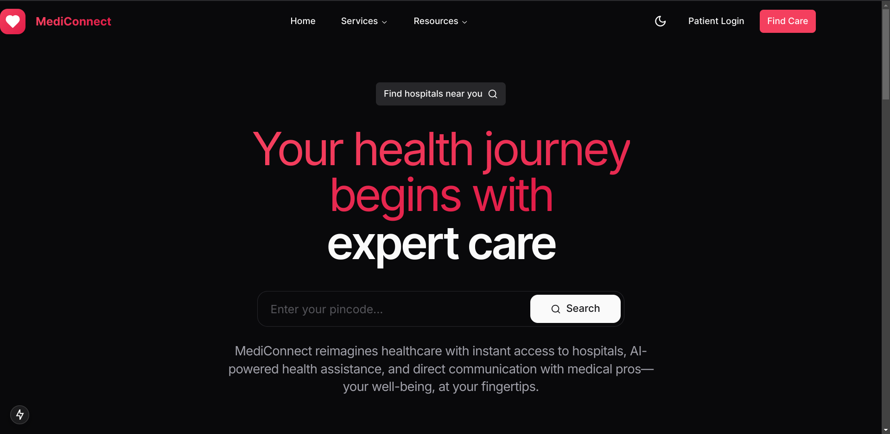

# MediConnect

AI-powered healthcare platform that streamlines patient care with personalized insights, secure data management, and 24/7 support - making quality healthcare more accessible and efficient."

## Inspiration
Let's face it - healthcare is broken. Doctors are overwhelmed, patients are frustrated with long wait times, and important health information gets lost in outdated systems. We built MediConnect because we believe everyone deserves better healthcare access. Our goal? Use modern technology to make healthcare work better for both patients and providers.

## What it does
Think of MediConnect as your healthcare command center:
* Get personalized health recommendations powered by AI
* Manage all your medical records and appointments in one place
* Message your healthcare team securely, anytime
* Track your health progress with real-time insights
* Access 24/7 support when you need it most
* Connect with a community of healthcare providers

## How we built it
We combined the latest tech to create something special:
* Built a lightning-fast interface with Next.js 15 and React 19
* Made sure everything's rock-solid with TypeScript
* Created a beautiful, easy-to-use design with Tailwind CSS
* Added smart health insights using Google's AI
* Kept your data safe and secure with Supabase
* Made sure everyone can use it with accessible UI components

## Challenges we ran into
Building a healthcare platform isn't easy. We had to:
* Navigate complex HIPAA rules while keeping things user-friendly
* Find the right balance between AI assistance and human care
* Lock down sensitive medical data with serious security
* Make it work for tiny clinics and huge hospitals alike
* Design something that both doctors and patients would love using

## Accomplishments that we're proud of
We're pretty excited about what we've built:
* Created a healthcare platform that actually makes sense
* Got AI working alongside healthcare providers
* Built something that's both secure and HIPAA-compliant
* Made it so simple that anyone can use it
* Connected patients and providers in real-time

## What we learned
This journey taught us a lot:
* Healthcare security is no joke - it needs serious attention
* AI can help doctors, not replace them
* Good design makes healthcare better for everyone
* Building for scale is crucial in healthcare
* Technology should enhance the human side of medicine

## What's next for MediConnect
We're just getting started! Coming up:
* Connecting with existing health record systems
* Smarter AI predictions for better health outcomes
* Mobile apps for on-the-go healthcare
* Taking MediConnect worldwide with multiple languages
* Adding support for health tracking devices
* Building specialized tools for different medical fields

## Dataset used:

- https://www.kaggle.com/datasets/thedevastator/comprehensive-medical-q-a-dataset

## Demo credentials
- username:admin 
- password:admin123